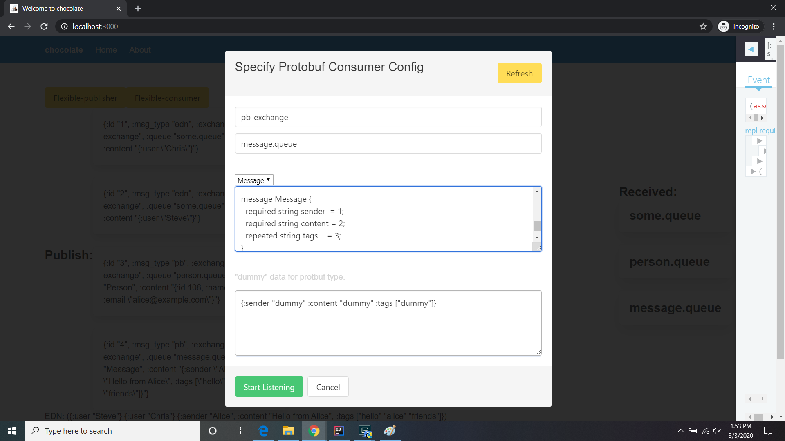

# Using the Client

When the client opens, you should see a display like this:

_fig. 1_

Key parts of this interface are:

- A yellow button labeled "Flexible-publisher" which wil be discussed later.

- - Another yellow button labeled "FLexible-consumer" which will also be discussed later.

- 2 columns of *large* buttons. The buttons on the left are for publishing statically defined message. The buttons
on the right start consumers ("listeners" or "subscribers") to specific queues.

_fig. 2_

Along the bottom (see fig. 2), are a number of text area, one per "Received" button. As messages are received from  
a queue, the contents will be appended to the contents of the corresponding text block.

- Clicking on a "Publish:" button (left-hand column) will cause the corresponding content to be published.

- Clicking on a "Received:" button starts the consumer. Any messages published to each queue will be reflected in the
- appropriate list at the bottom (see fig 2.)

### The "Flexible-publisher" Button

Clicking on the yellow button opens a modal:

Filling out the various field let you create a custom message to be published to any exchange/queue combination you like.

_fig. 3_

> Note: There is absolutely NO error checking on this modal, so if you make any mistakes (typos, incorrect or missing parameters,
> etc.) the modal will NOT help you out. User Be Careful!

### The "Flexible-consumer" Button

Clicking on the other yellow button opens a modal to configure a protocol buffer-specific consumer. Filling out  
the various field let you define the configuration for a consumer to any exchange/queue/protobuf-type you want.

_fig. 4_

> Note: Again, there is absolutely NO error checking on this modal, so if you make any mistakes (typos, incorrect or missing parameters,
> etc.) the modal will NOT help you out. User Be Careful!

### RabbitMQ Console

If you prefer, you can also look at the RabbitMQ console to see the message traffic and even examine the messages themselves.

> Note: if you have any consumers running they will likely grab messages published to their queues so quickly that
> the console, which only updates every few seconds, can't keep up. It's best to use the console when you DON'T start any
> consumers, so the messages just sit around while you look them over.

