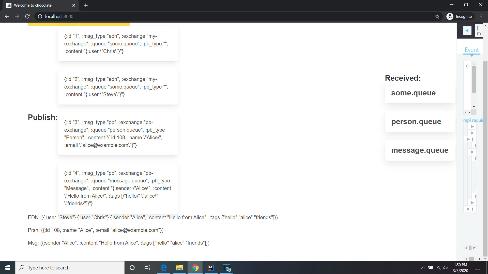
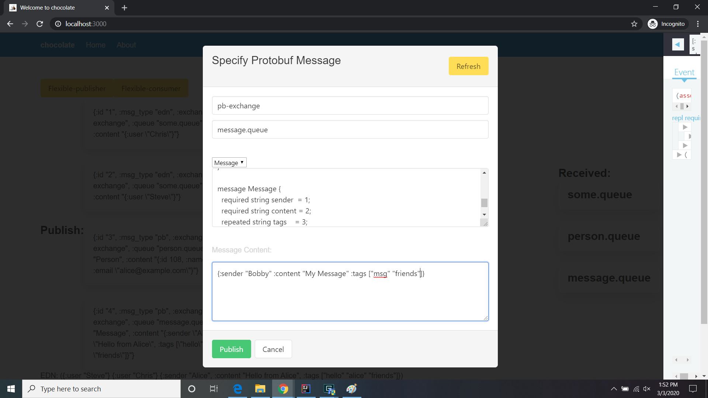

# Using the Client

When the client opens, you should see a display like this:

_fig. 1_

Key parts of this interface are:

Yellow button labeled "Flexible protobuf" which wil be discussed later.

2 columns of *large* buttons. The buttons on the left are for publishing statically defined message. The buttons
on the right start consumers ("listeners" or "subscribers") to specifc queues.

_fig. 2_

Along the bottom (see fig. 2), are a number of text area, one per "Received" button. As messages are received form the  
a queue, the contents will be appended ot the contents of the corresponding text block.

Clicking on a "Publish:" button (left-hand column) will cause the corresponding content to be published. Clicking on
a "Received:" button starts the consumer. Any messages published ot each queue will be reflected in the appropriate list at the bottom (see fig 2.)

### The "Flexible protobuf" Button

Clicking on the yellow button opens a modal:

_fig. 3_

Filling out the various field let you create a custom message to be published to any exchange/queue combination you like.

_fig. 4_

> Note: There is absolutely NO error checking on this modal, so if you mak any mistakes (typos, incorrect or missing parameters,
> etc.) the modal will NOT help you out. User Beware!

### RabbitMQ Console

You can also look at the RabbitMQ console to see the message traffic and even examine the messages themselves.

